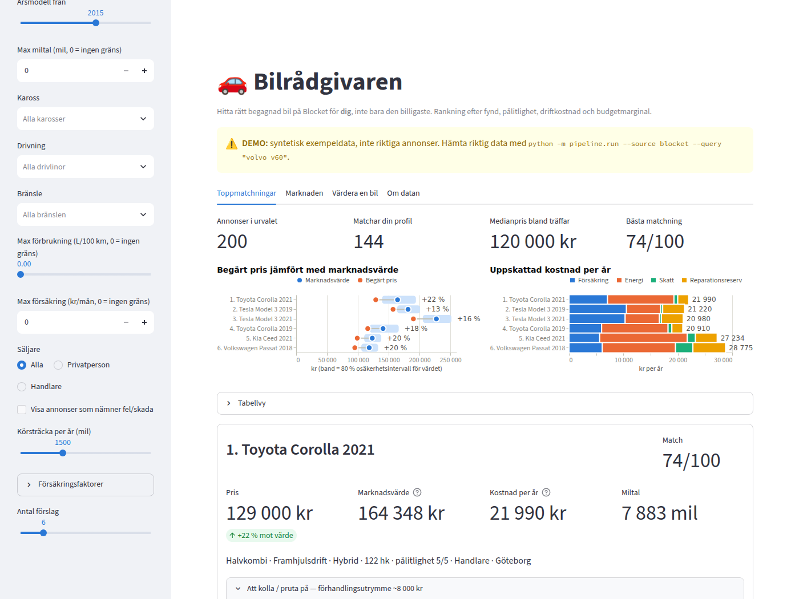
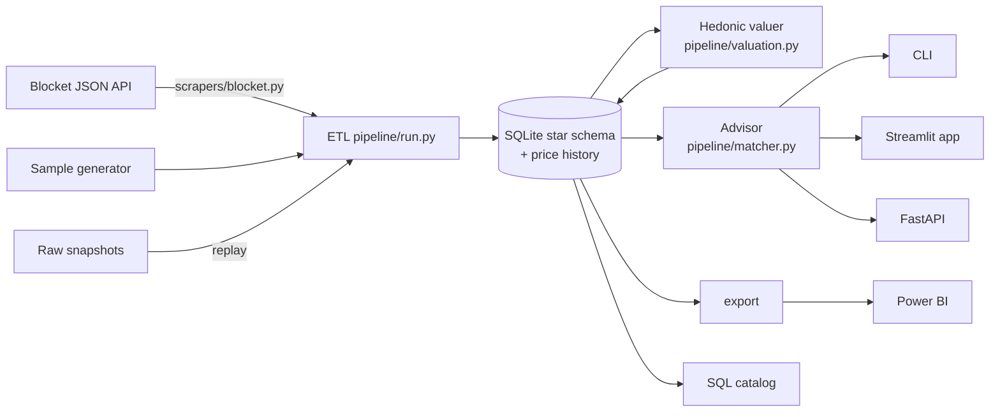

# Swedish Car Deal Finder & Buyer Advisor

Help a **private buyer** find the right used car on **Blocket**, not just the cheapest one.
The tool reads Blocket's car search and values every car against comparable listings (same
model, age, mileage for its age and equipment). It then ranks cars by how well they fit *that
buyer*: deal, reliability, running costs and budget headroom. Each car gets an estimated
**total cost of ownership** and a **"what to check / haggle on"** briefing.



> Example: an Audi A4 2.0 TFSI (2008–2012) is a known oil burner. The advisor flags it, tells
> you what to inspect and gives you ~15 000 kr of negotiation leverage to verify. Two A4s at
> 50 000 kr are not equal buys if one has driven 20 000 mil and the other 10 000, and the
> valuation model accounts for that.

## What's inside

| Layer | What it does |
|---|---|
| **Blocket client** | Reads Blocket's public JSON car-search API. Blocket moved to the FINN/Vend platform in late 2025, see [docs/BLOCKET_API.md](docs/BLOCKET_API.md). Handles paging, retries/backoff, mil→km conversion with a plausibility check, seller type, regnr, AWD/hp parsing and county resolution for all 290 municipalities. Raw snapshots allow offline replay. |
| **Valuation** | A hierarchical hedonic regression: log price ~ age + mileage vs normal for the age + equipment, pooled global → brand → model → model year, leave-one-out, with an 80 % interval, monotonicity guards and damage-word screening. See [evaluation](docs/VALUATION_EVAL.md). |
| **Star schema** | SQLite with 4 dimensions (car, location, seller, calendar), listings and daily price snapshots, reference tables, model output and a run log. Views are the semantic layer. |
| **Advisor** | Hard filters (budget, year, mileage, body, drivetrain, fuel, L/100 km, insurance, seller type, damage), a 0–100 match score that is **never discount alone**, TCO, known faults (47, fuel-aware), general checks, private vs dealer rights, regnr history links. |
| **Interfaces** | CLI · **Streamlit app** ("Bilrådgivaren") · **FastAPI** REST API with OpenAPI docs |
| **Analytics** | 17-query SQL catalog (window functions, CTEs), SQL exercises, **Power BI kit** (export, relationships, 20+ DAX measures, theme) |



## Quickstart

```bash
python -m venv .venv
.venv/Scripts/python.exe -m pip install -r requirements-dev.txt   # Windows (macOS: .venv/bin/python)
```

**1. Offline demo (synthetic data, always labelled DEMO)**
```bash
python -m pipeline.run --source sample              # -> car_deals_sample.db
python -m pipeline.recommend --db car_deals_sample.db --budget 220000 --body Kombi,Halvkombi
```

**2. Real Blocket data (from a normal internet connection)**
```bash
python -m scrapers.blocket --probe --query "volvo v60"     # FIRST: verify the live format
python -m pipeline.run --source blocket --query "volvo v60" --pages 5
python -m pipeline.run --source blocket --make Volvo,Toyota --county "Östergötlands län" --pages 10
python -m pipeline.recommend --budget 200000 --seller private --drivetrain AWD
```
Run the same searches daily to build price history and see which cars sell (ads that vanish
from a fully scanned search are marked inactive). Raw pages are saved to `data/raw/`, and
`--source replay --replay data/raw/blocket/<date>` rebuilds without touching Blocket.

**3. App and API**
```bash
streamlit run app/streamlit_app.py --server.port 8501     # Bilrådgivaren
uvicorn api.main:app --port 8000                          # REST API, docs at /docs
```
Both read `car_deals.db` (override with `CAR_DEALS_DB=...`). Without real data they show a
labelled demo. The same commands are registered in `.claude/launch.json`.

**4. SQL and Power BI**
```bash
python -m analysis.sql_runner --list                      # run the SQL catalog
python -m pipeline.export --format parquet                # star schema -> powerbi/data/
```
Then follow [powerbi/README.md](powerbi/README.md). To learn SQL on this data, start with
[analysis/SQL_GUIDE.md](analysis/SQL_GUIDE.md).

## REST API

| Method | Path | Purpose |
|---|---|---|
| GET | `/health` | status, data source, last ETL run |
| POST | `/recommend` | buyer profile → ranked shortlist with TCO and briefing |
| POST | `/valuate` | value **any** car (brand, model, year, mileage, price) against the market |
| GET | `/listings`, `/listings/{id}` | filter/sort active listings; one listing + issues + price history |
| GET | `/market/models`, `/market/deals`, `/market/depreciation` | market overview, credible deals, depreciation curve |
| GET | `/reference/specs`, `/reference/issues` | curated reference data |

Every response carries `"demo": true|false`.

## Project structure

```
scrapers/     blocket.py (JSON API client, probe, replay) · blocket_codes.py · blocket_brightdata.py (optional)
              sample_data.py (synthetic, with hidden ground truth) · carinfo.py (legacy cohort valuer)
pipeline/     run.py (ETL) · valuation.py (hedonic model) · matcher.py (advisor) · insurance.py
              recommend.py (CLI) · service.py (shared by app+API) · export.py (Power BI)
database/     schema.sql (v2 star schema) · views.sql (semantic layer) · db.py
reference/    specs_data.py (126 variants / 76 models) · known_issues_data.py (47) · geo_data.py · lookup.py
api/          main.py (FastAPI)
app/          streamlit_app.py · charts.py (validated palette)
analysis/     queries.sql · sql_runner.py · SQL_GUIDE.md · evaluate_valuation.py
powerbi/      README.md · measures.dax · theme.json · sample_data/
docs/         BLOCKET_API.md · VALUATION_EVAL.md · SESSIONSLOGG_2026-09-26.md (sv) · REVIEW_BRIEF.md
tests/        72 pytest tests (client, valuation, DB, matcher, pipeline, API, SQL, export)
```

## Tests

```bash
python -m pytest            # 72 tests, ~2 s, fully offline
```
They include an end-to-end run of the real-data path without network access (fixture →
snapshots → replay ETL → advisor), the insurance calibration points, monotonicity of the
valuation, and a check that every SQL catalog query and exercise solution runs.

## Honesty notes

- **Live Blocket data has not been verified from the development environment.** Its network
  policy blocks blocket.se. The client follows published documentation of the endpoint, and
  the fixtures are *constructed*. Run the probe first; it prints a PASS/CHECK verdict.
- **Market value = an estimate** from comparable *asking* prices, not transaction prices and
  not a car.info valuation. Every value has an interval and a confidence label. Since 2025
  the ads carry `regno`, so a licensed external valuation can be plugged in later.
- **Insurance is a calibrated estimate**, not a quote. Specs, tax and negotiation amounts are
  approximate.
- **Known issues are prompts to verify**, not a diagnosis. Always get an inspection.
- **Sample data is synthetic** and always labelled as a demo. It never mixes with real data
  (separate database files, enforced).
- Personal/educational use: polite request rate, and respect Blocket's terms of use.

## Roadmap

- [x] Star schema, ETL, advisor, calibrated insurance
- [x] Blocket client for the post-2025 JSON API, probe, replay
- [x] Year/mileage-aware valuation (hierarchical hedonic, LOO) with evaluation
- [x] Advisor reads the DB; price history; sold detection; seller-aware briefing
- [x] pytest suite · Streamlit app · FastAPI · SQL catalog · Power BI kit
- [ ] **Run the probe against live Blocket** and replace the constructed fixtures with a capture
- [ ] Daily scheduled ETL (Windows Task Scheduler) → build the Power BI report on real history
- [ ] Measure valuation accuracy on real data (hold out listings; compare with sold prices)
- [ ] External valuation by regnr (licensed source) as a second opinion
- [ ] PostgreSQL + cloud deploy of app/API
