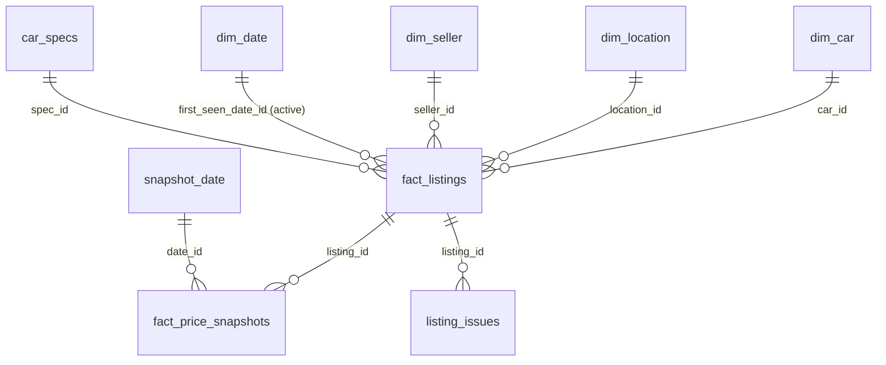

# Power BI kit — Car Deal Finder

Everything you need to build the market dashboard in **Power BI Desktop** (free, Windows):
a star-schema export, the relationships, ready DAX measures, a colour theme and a page plan.
Building it yourself is the point: this is where the SQL and data-modelling work turns into
something you can show on a CV.

| File | What it is |
|---|---|
| `sample_data/*.csv` | A ready export of the **synthetic demo** database (`source = sample`) for practice. Not real listings. |
| `data/` | Your own exports (gitignored): `python -m pipeline.export` |
| `measures.dax` | 20+ DAX measures with comments |
| `theme.json` | Report theme: the same colour-blind-validated palette as the Streamlit app |

## 1. Get data

```bash
# real data (after python -m pipeline.run --source blocket ...)
python -m pipeline.export                   # -> powerbi/data/*.csv
python -m pipeline.export --format parquet  # typed columns, recommended
```

For practice, use `powerbi/sample_data/`. It holds the same tables, built from synthetic data.

## 2. Load the tables

**Home → Get data → Text/CSV** (or **Parquet**) and load these files:
`fact_listings`, `fact_price_snapshots`, `dim_car`, `dim_location`, `dim_seller`,
`dim_date`, `car_specs`, `listing_issues`, `valuation_models`, `etl_runs`.

> **Swedish Windows?** CSV uses a dot as decimal separator. In Power Query select the numeric
> columns → *Change type → Using locale… → English (United States)*. Otherwise `12.5` can
> turn into `125`. Parquet files avoid this completely.

In Power Query, also set `dim_date[date]` to type **Date**.

## 3. Model: relationships (star schema)



| From (many) | To (one) | Active | Notes |
|---|---|---|---|
| fact_listings[car_id] | dim_car[car_id] | ✔ | brand, model, model_year, fuel, gearbox |
| fact_listings[location_id] | dim_location[location_id] | ✔ | city + county (map visuals) |
| fact_listings[seller_id] | dim_seller[seller_id] | ✔ | private vs dealer |
| fact_listings[spec_id] | car_specs[spec_id] | ✔ | body type, drivetrain, reliability |
| fact_listings[first_seen_date_id] | dim_date[date_id] | ✔ | default date: when we first saw the ad |
| fact_listings[published_date_id] | dim_date[date_id] | ✖ inactive | used via `USERELATIONSHIP` |
| fact_listings[last_seen_date_id] | dim_date[date_id] | ✖ inactive | "removed/sold" date |
| fact_price_snapshots[listing_id] | fact_listings[listing_id] | ✔ | single direction |
| listing_issues[listing_id] | fact_listings[listing_id] | ✔ | drill-through table |
| fact_price_snapshots[date_id] | snapshot_date[date_id] | ✔ | see below |

**Why two date tables?** If `dim_date` also filtered `fact_price_snapshots`, there would be two
paths from `dim_date` to the snapshots (directly, and through `fact_listings`). Power BI calls
that an ambiguous model. The fix is a role-playing date table. Create it with
*Modeling → New table*:

```dax
snapshot_date = dim_date
```

Then **mark both as date tables** (*Table tools → Mark as date table → column `date`*).
`valuation_models` and `etl_runs` stay unrelated. They get their own visuals and slicers.

## 4. Measures

*Home → Enter data* → create an empty table named `_Measures`. Then add each measure from
`measures.dax` with *New measure*. Start with `Active Listings`, `Median Price`,
`Credible Deals` and `Avg Discount %`. Set the format hint in the comment, e.g. percentage.

## 5. Theme

*View → Themes → Browse for themes* → `powerbi/theme.json`.
Categorical colours are assigned in a fixed order. Keep a model's colour the same on every
page and never repaint when a filter changes. The good/neutral/bad colours are for status
(conditional formatting), not for series.

## 6. Report pages (suggested)

1. **Marknadsöversikt**
   - KPI cards: `Active Listings`, `Median Price`, `Avg Discount %`, `Credible Deal Share`,
     `Data Freshness`.
   - Filled map by `dim_location[county]` with `Active Listings`.
   - Bar chart by `dim_car[brand]` with `Active Listings`, sorted descending.
   - One slicer row at the top: brand, model year, seller type, fuel.
2. **Fynd** (deals)
   - A table of active listings: brand, model, year, price, market value, discount,
     `deal_z`, city and url. Apply conditional formatting to discount with the diverging
     theme colours.
   - Scatter chart: x = `market_value_sek`, y = `price_sek`, details = `listing_id`. Points
     below the diagonal are cheap. Add a constant line y = x under *Analytics*.
   - Drill-through to a listing page showing `listing_issues` (what to check) and price
     history.
3. **Värdeminskning** (depreciation)
   - From `valuation_models`: bar chart of `depreciation_pct_per_year` by model, sorted.
   - Small multiples of `value_age3_sek` vs `value_age8_sek`.
   - A slicer on `fitted_date_id` shows how the market moves between runs.
4. **Prishistorik & tid på marknaden**
   - Line chart of `Snapshot Median Price` by `snapshot_date[date]`. It needs daily ETL runs.
   - Histogram of `days_on_market` (bin it in Power Query), plus `Price Cut Listings` and
     `Avg Price Cut %`.
5. **Datakvalitet**: `etl_runs` as a table (listings loaded, new, price changes, deactivated
   per run). Showing lineage is a mark of maturity.

Design rules that keep it looking professional: thin bars, no 3-D, no dual axes, one slicer
row per page, a title that states the insight ("Toyota håller värdet bäst: −9 %/år"), and a
tooltip on every visual.

## 7. Refresh workflow

```bash
python -m pipeline.run --source blocket --query "volvo v60" --pages 10   # e.g. daily
python -m pipeline.export --format parquet
```
Then click *Refresh* in Power BI. To automate it, schedule the two commands with Windows
Task Scheduler. Daily runs are what make the price-history and "sold within X days" pages
come alive.

**Option B, a live connection:** install the SQLite ODBC driver
(<http://www.ch-werner.de/sqliteodbc/>), create a DSN that points at `car_deals.db`, and use
*Get data → ODBC*. This skips the export step and teaches you ODBC, at the cost of one more
driver on your machine.

## 8. What to write on the CV

- *Designed a star-schema data model (SQLite, 4 dimensions + 2 fact tables, continuous date
  dimension, role-playing dates) and a Power BI semantic model with 20+ DAX measures
  (time intelligence, USERELATIONSHIP, RANKX).*
- *Built an ETL pipeline in Python that ingests Blocket's car-search API, tracks daily price
  history and flags sold listings, with a run log for data lineage.*
- *Estimated market value with a hierarchical hedonic regression (partial pooling,
  leave-one-out), which cut valuation error from 8.3 % to 5.2 % MAPE against the cohort-median
  baseline on synthetic ground truth.*
